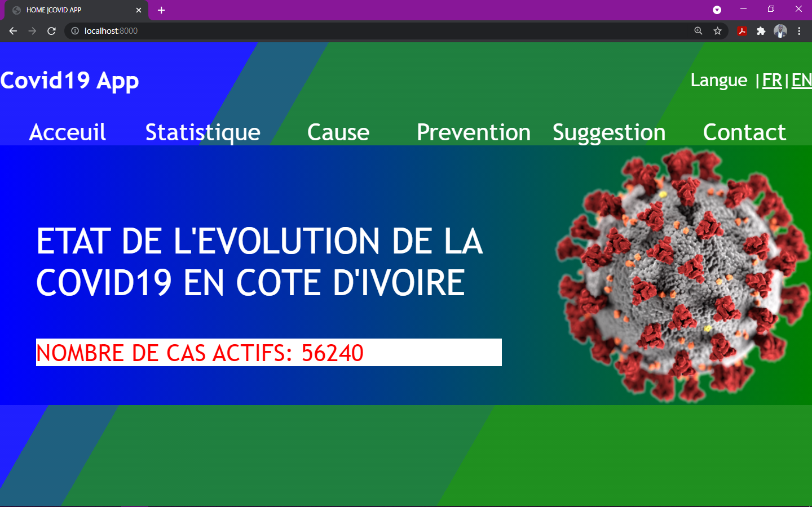

# COVID19 APP PROJECT WITH DJANGO 

## Welcome! 👋👋👋👋👋👋👋

Merci d'être passé par ici.

## help django

django-admin help:

1. Star project

django-admin startproject <project_Name>

2. Star App
django-admin startapp <app_Name>

3. Create news Admin 
python manage.py createsuperuser

4.before to create admin, authentify this migration 
to see all migration 
python manage.py makemigrations

5.Uprade Migration; to init Admin user Migration
 python manage.py migrate

6.To run Server 

python manage.py runserver 

///////////////////

## Configuration de  l'application
1. Add covid19 to INTALLED App

2. Add Template to TEMPLATES-> DIR[]

3 .ADD STATICFILES-DIRS=['static']

4. path :Covid20/Settings.py

## Author:
Augustin GRAH
[GitHub](https://github.com/augustCalibre)